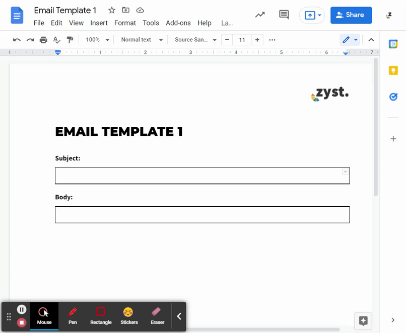
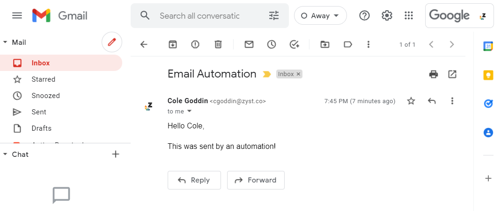

# Email Automation
This is a program to automate my email campaigns for marketing my services.  It is based on Google Docs, and Google Email.

## Status
Version 1 Depolyed. Read me still in progress

## Motivation
I created this project to maximize my prospecting efforts for my social media marketing agency, Zyst, and refine my skills as a developer. By automating the process, I can send more emails, raise my response rate, and focus on more important matters.

## User Experience

Interface
 

Templates
 

Email
 

## Features

- Automatically sends a 5 email sequence
- Customizable templates
- Editable time delta between emails
- Email personalization
- Tracks sent time
- Collects send recepts
- Creates editable draft in draft folder before sending
- Runs on Google Cloud Platform

## Installation
Do the following steps to get your own email campgain up and running on your own google workspace.

1. Do this
2. Now this
3. Then this

## Dependencies Used
- gspread
- gspread_dataframe
- pandas
- pygsheets
- pydrive

## Author
Cole Goddin
